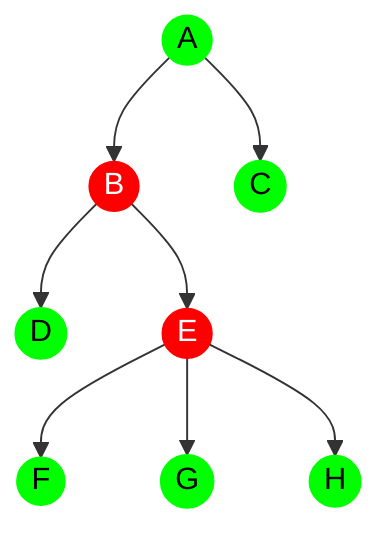
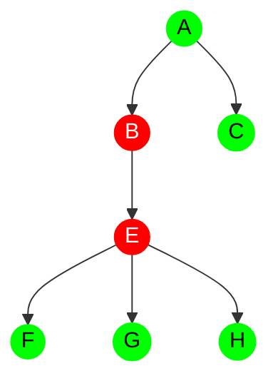
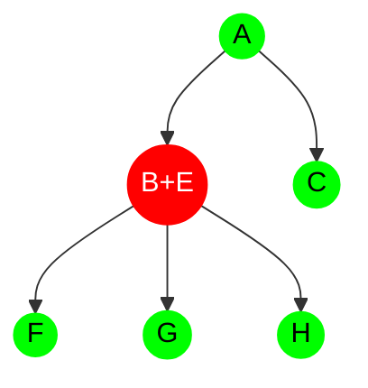

# forke

`forke` is a thread-safe tree implementation in Rust, where each node can store arbitrary, generic data.

The core idea behind `forke` is that when a node is no longer needed, it is merged with its descendant or discarded if there are none. A node is considered useless if it has been dropped by the user and has no more than one child. When a merge happens, the associated data is combined using the `Merge` trait.

## Example

Consider the following tree where red nodes are dropped by the user, and green nodes are still in use:

Let’s assume the user drops node `D`. The following changes will occur in the tree:

1. **Node `D` is discarded:** The node D and its associated data are removed from the tree.

2. **Node `B` is considered useless:** Since node `B` now only has one child (node `E`), it is considered useless and is removed. The data associated with node `B` is merged with node `E`'s data.

